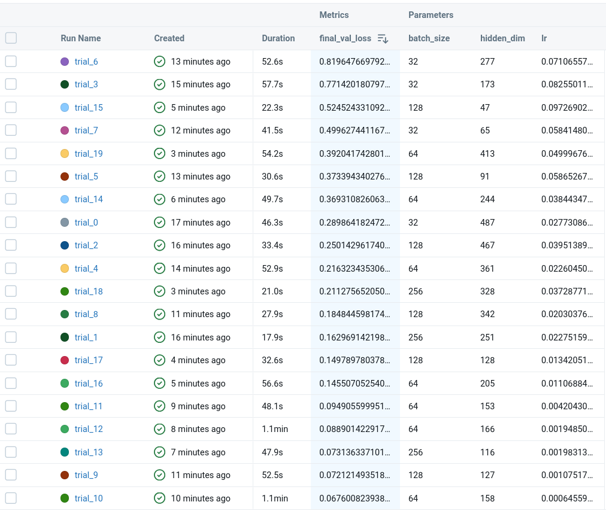
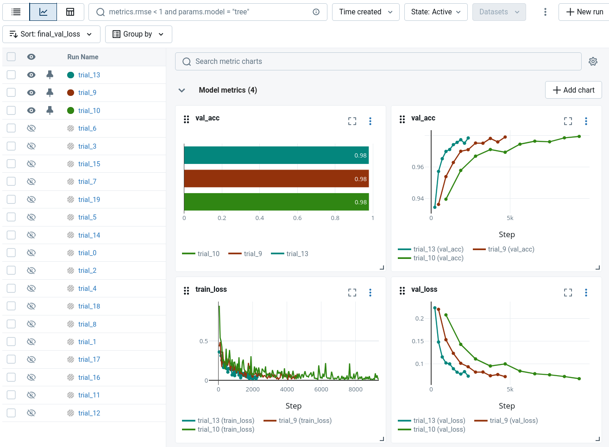

# HW 1: Pytorch, Pytorch Lightning, Model monitoring, Hyper-parameter optimization

## Lightning Module
I decided to implement a very simple feedforward neural network for classifying MNIST digits using PyTorch Lightning. The reason for such simplicity is to focus on the Lightning framework and hyper-parameter optimization rather than building SOTA models. I don't have access to a GPU, so
I kept the model lightweight to still be able to try multiple hyper-parameter combinations within a reasonable time frame.
```python
class LitClassifier(pl.LightningModule):
    def __init__(self, lr=1e-3, hidden_dim=128):
        super().__init__()
        self.save_hyperparameters()

        self.model = nn.Sequential(
            nn.Flatten(),
            nn.Linear(28 * 28, hidden_dim),
            nn.ReLU(),
            nn.Linear(hidden_dim, 10),
        )
        self.loss_fn = nn.CrossEntropyLoss()

    def forward(self, x):
        return self.model(x)

    def configure_optimizers(self):
        return torch.optim.AdamW(self.parameters(), lr=self.hparams.lr)

    def training_step(self, batch, batch_idx):
        x, y = batch
        logits = self(x)
        loss = self.loss_fn(logits, y)
        self.log("train_loss", loss, prog_bar=True)
        return loss

    def validation_step(self, batch, batch_idx):
        x, y = batch
        logits = self(x)
        loss = self.loss_fn(logits, y)
        acc = (logits.argmax(dim=1) == y).float().mean()
        self.log("val_loss", loss, prog_bar=True)
        self.log("val_acc", acc, prog_bar=True)
        return loss
```

## Main problems encountered (for others to learn from your mistakes)
At first i started with more difficult problem (CIFAR-100) and a more complex model (CNN with multiple layers). However, training was very slow on CPU and I couldn't complete enough trials for hyper-parameter optimization. Therefore, I switched to MNIST and a simple feedforward network to ensure that I could run multiple trials in a reasonable time frame.

It seems that giving too many options to optuna is also not a good idea because the search space becomes too large. In the end I only settled on 3 hyper-parameters to optimize.

## Results of training in chosen monitoring tool with training and validation curves
Here are all the runs that were logged to MLflow during hyper-parameter optimization sorted by validation loss:


And here are the training and validation loss curves for the 3 best runs:

As you can see we achieved accuracy of almost 98% on the validation set with the best hyper-parameter combination. 

## Results of hyper-parameter optimization: Showcasing what parameter have you optimized and how it improved validation metrics?
I optimized the following hyper-parameters using Optuna:
1. **Batch size**: categorical choice among \[32, 64, 128, 256\] \
It turned out that bigger batch sizes worked better on average. The worst models have used batch size of 32. While all models trained with batch size of 256 seemed to perform well.
2. **Hidden layer dimension**: integer between 32 and 512 \
When it comes to hidden layer dimension it seems that 100-200 range was a sweet spot. Too small dimensions (below 64) led to underfitting while too large dimensions (above 400) led to overfitting.
3. **Learning rate**: continuous float between 1e-4 and 1e-1 \
Learning rate didn't have a significant impact, it seems that modern optimizers (like AdamW) are quite robust to different learning rates. However, the best models seemed to use learning rates between 0.001 and 0.02.